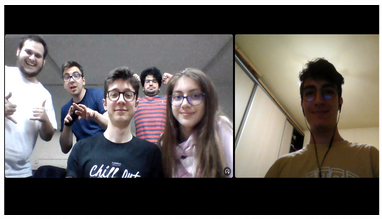

[LSAC IT](https://github.com/LSAC-ONG) has a blog! We will use it to share our knowledge and experience with the world.

The blog supports tags as well!

Here we can hold the news that we talked about!

## Proposal

Here we can actually put **minute ale sedintelor** and we can set the tag "Sedinta", "Minuta" and can be searched by the tag