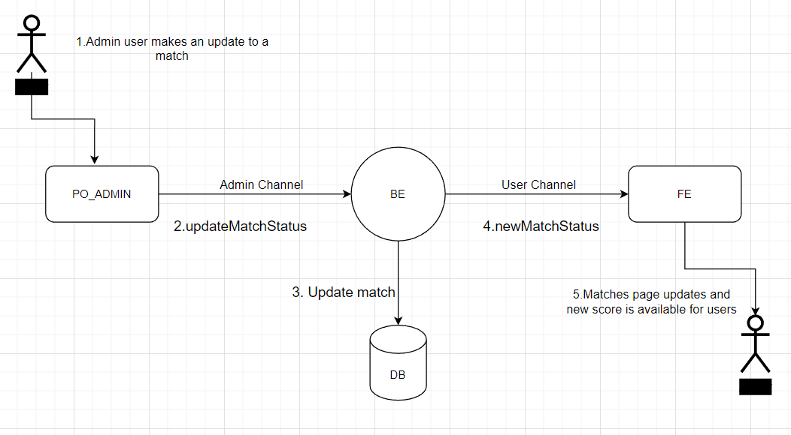

# WebSockets

*This README contains information about WebSockets flow in our program, for more technical details, check Websockets.md*.

### **Introduction**
In our BE/index.js, we create our Websocket Server. We use cors to accept request from any origin, and "@socket.io/cluster-adapter" with "@socket.io/sticky" to run it on cluster on production.

We use namespaces to create separate channels for admins (used in admin panel to update live scores) and the other users (used in our FE app to check the live scores).

``` javascript
const userNameSpace = io.of(constants.namespaces.user); // users channel
const adminNameSpace = io.of(constants.namespaces.admin); // admin channel
```

### **Flow**

In admin, every time there is an update, is sent to backend an event *"updateMatchStatus"* that handles the update, making the update in our database and sending an *"newMatchStatus"* event to our user channel.


